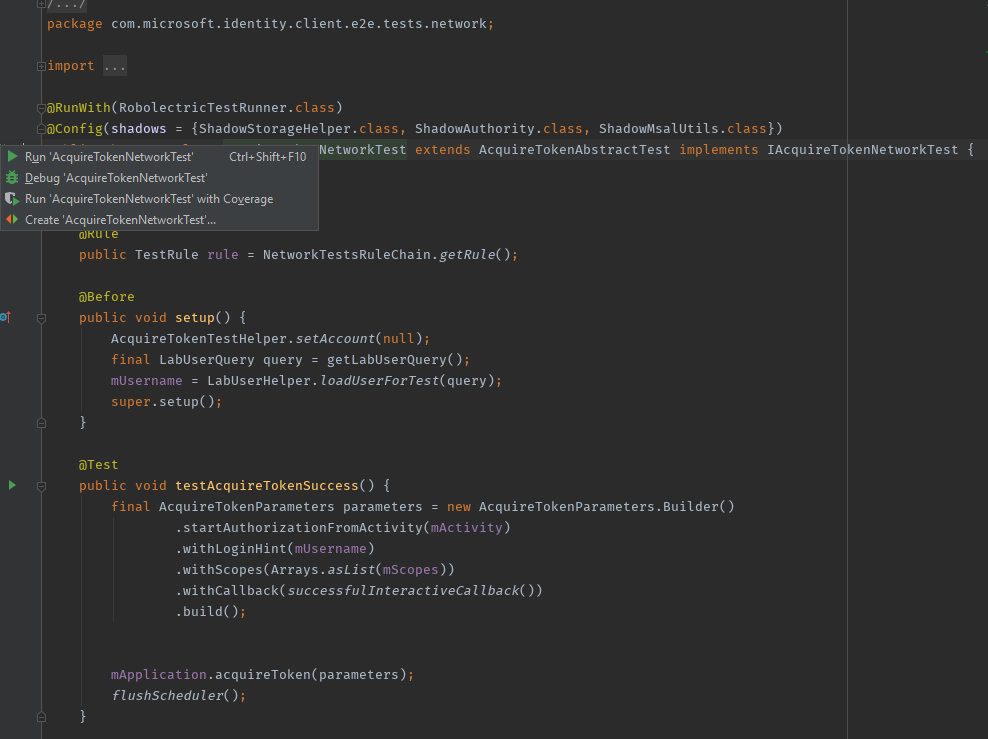
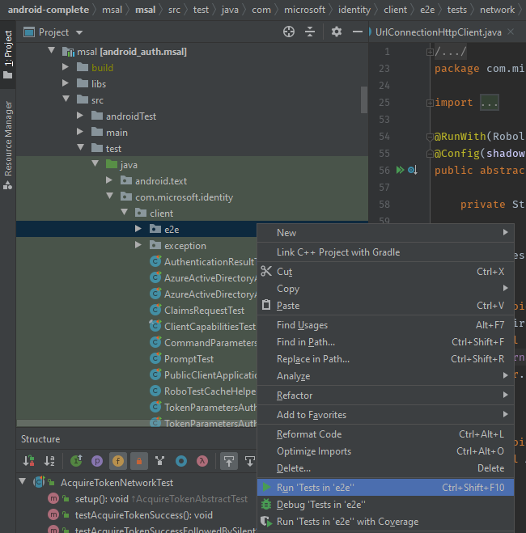

# How to run Android Auth Client SDK Tests

In this doc, we will go over how to run tests on Android as well as how to *specifically* run Auth Client SDK tests properly (as there might be some nuances).

## Related Readings

- [Testing Overview](./testing_overview.md)

- [Lab Setup](./labsetup.md)

- [Gradle Project Properties as Command Line Arguments](../ProjectBuild/gradle_project_properties.md)

## General Ways to run Android Tests

In general Android Tests can be run in a couple of ways:

### Run from Command Line

We can run Android Tests from command line by executing the gradle command:

`./gradlew <module>:<testCommand>`

For example, one could run the unit tests in a project called as `msal` as follows:

`./gradlew msal:testLocalDebugUnitTest`

We can also pass flag and parameters to filter based on class, package etc. We can learn more here: [Test from the command line - Android Developers](https://developer.android.com/studio/test/command-line)

### Run from Android Studio

We can also run test(s) from Android Studio by clicking the run button as follows

#### Running a single test

#### Running all Tests in a Class

#### Running all Tests in a Package

## How to run Auth Client SDK Tests

Prior to reading this, please read the [Testing Overview](./testing_overview.md) doc as we will refer to some concepts here that are meantioned in that doc.

When it comes to running our tests, the primary differences lie in whether the test makes a network request or not, because tests that make network requests are usually tests that go to AAD using real accounts for testing token acquisition. Any tests that are using real accounts for testing E2E flows are using Accounts supplied by the Lab API. Lab API is a protected API and we authenticate against that using a confidential client. This means that we would need to supply the `labSecret` as a command line argument when running any tests that use the Lab API. For more info, please read this: [Lab Api](./labsetup.md)

### UI Automation

UI Automation Tests support passing some additional command line arguments as well that can control the behavior of the tests. These arguments may or may not be needed depending on your needs if you find yourself sticking to the defaults. For a complete list of supported command line arguments across each of our projects, please see [Gradle Project Properties as Command Line Arguments](../ProjectBuild/gradle_project_properties.md).

#### Supported Flavors

The UI Automatio can be run against a variety of flavors across the auth library being useds as well as the broker being used.

See `./gradlew msalautomationapp:tasks` or `./gradlew brokerautomationapp:tasks` for a complete list of tasks.

##### MSAL / ADAL

- local - Use local source code present on your machine and branch currently checked out

- dist - Use MSAL / ADAL from Maven Central based on version specified in `build.gradle`

##### Broker

- BrokerMicrosoftAuthenticator - runs tests against Microsoft Authenticator as the broker app

- BrokerCompanyPortal - runs tests against CompanyPortal as the broker app

- BrokerHost - runs tests against BrokerHost as the broker app

- AutoBroker - runs tests against any supported broker for a given test as applicable with the select flavor of MSAL / ADAL
